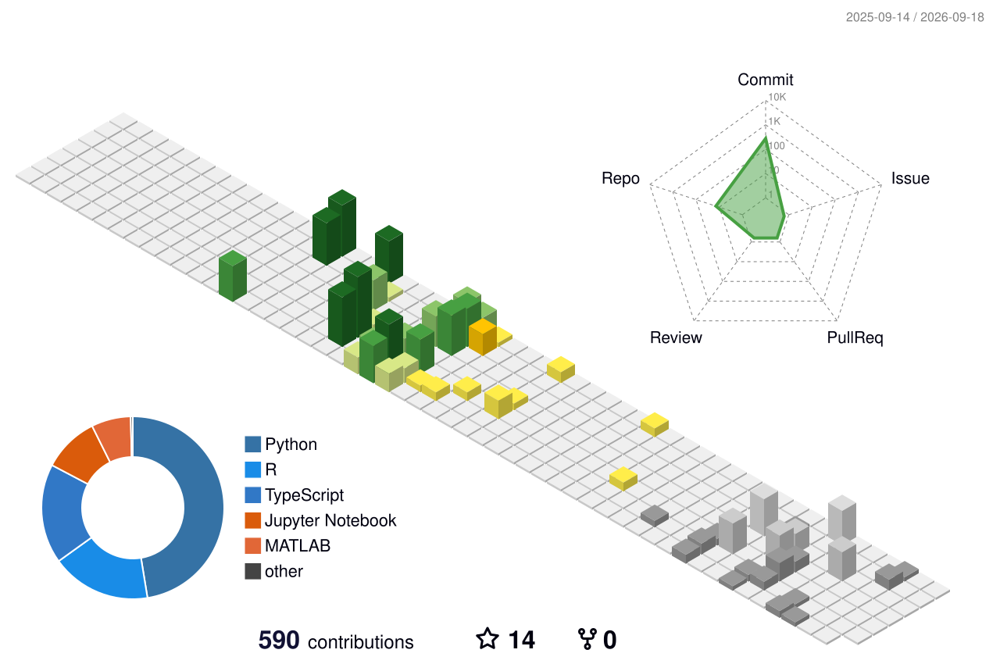

# 👋 Hi, I’m Parmesh Kumar  

> *Exploring ideas at the intersection of science, data, and real-world impact. People love to call me "Sheldon Lee Cooper", a fictional character in The Big Bang Theory Series.*

---

I am currently working on an **Advanced AI-Driven Medical Health Monitoring & Diet Recommendation System**.

Beyond this, my interests span across:
- 📈 **Business intelligence dashboards with Power BI & Tableau**
- 🤖 **Applied AI use-cases data processing using Python and SQL**
- 🏥 **Healthcare analytics & public-sector systems**
- 🧠 **Decision science and large-scale impact models by turning complex data into clear decisions**

I cherish breaking down complex scientific ideas into simple explanations and actively engaging with curious minds to collaborate.

---

## 🌐 Connect With Me

---

## 📊 GitHub Stats

<table width="100%" cellspacing="0" cellpadding="0">
<tr>

<!-- LEFT PANEL -->
<td width="48%" valign="top">

  

<!-- 
 -->
 <!--  
   <!--  src="https://github-readme-stats-fast.vercel.app/api?username=theparmeshkumar&background=FFFFFF&hide_border=false&include_all_commits=false&count_private=false&layout=compact"  -->
   <!--  alt="GitHub Conributions" -->
  <!--   width="400" -->
<!--   /> -->
<!-- 
 -->

 
 

</td>

<!-- RIGHT PANEL -->
<td width="52%" valign="top">

  <!-- Profile Views Counter -->

<!-- Profile Views Counter -->

## 🧊 3D Contribution Calendar

  
 ## 📈 Activity Graph

 

</td>

</td>

</td>
</tr>
</table>

---

## 🚀 Top Featured Projects

<table width="100%" cellspacing="0" cellpadding="0">
<tr>

<!-- LEFT PANEL -->
<td width="48%" valign="top">

### 🏥 Advanced AI Medical Diagnosis System

An advanced AI-powered medical diagnosis and personalized dietary recommendations system [🔗Live](https://parmeshkumar.shinyapps.io/AdvancedAIMedicalDiagnosisSystem/)

### 🗒️ Sentiment SEBI Fraud Risk Dashboard

Interactive R Shiny dashboard for fraud risk analysis and sentiment tracking [🔗Live](https://parmeshkumar.shinyapps.io/sentiment-sebi-fraud-dashboard/)

### 🈸 Job Application Tracker

Cloud-based job application tracking web app with real-time analytics using Firebase and Vanilla JS [🔗Live](https://job-application-tracker-5723b.web.app/)

### 📑 Vibrant Resume

Advanced AI-based ATS-friendly resume building and optimizing web app with grammarly & Google Drive [🔗Live](https://vibrantresume.vercel.app/)

</td>

<!-- RIGHT PANEL -->
<td width="52%" valign="top">

### 🛞 Tyre Inventory Manager

Streamline automotive inventory (car tyres) management system for real-time tracking [🔗Live](https://tyremanager.vercel.app/)

### 🌐 The Moody Picasso (Website)

Designed and deployed a commercial website with a modern design & interactive UI/UX to showcase products [🔗Live](https://www.themoodypicasso.com/)

### 🚗 Car Brand Type Classification

Computer Vision model for car brand and type classification using R-programming language

### 🪪 Personal Portfolio

Portfolio showcasing professional journey featuring dark/light mode and a highly responsive & interactive UI/UX [🔗Live](https://theparmeshkumar.vercel.app/)

</td>

</td>
</tr>
</table>

---

## 💻 Tech Stack

<table width="100%" cellspacing="0" cellpadding="0">
<tr>

<!-- LEFT PANEL -->
<td width="48%" valign="top">

### 🧠 Programming & Data

### 🧠 Web Development & Deployment

### 🔢 Data Science & Statistical Computing Tools

[-958258?style=for-the-badge)](https://www.jmp.com/en/home)

### 📐 Mathematical & Scientific Computing

### 🎧 Audio Engineering & Media Production

</td>

<!-- RIGHT PANEL -->
<td width="52%" valign="top">

### 📈 Scientific Visualization & Business Intelligence

### 📊 Analytics & Machine Learning

### ☁️ Platforms & Productivity Tools

### 🎨 Creative & Design

</td>

</td>
</tr>
</table>

---

## ✍️ Inspiring Quote

> *“Curiosity is not a distraction. It’s the starting point of every meaningful system.”*

<!-- 
## 🏆 GitHub Trophies

-->

# 👋 Hi, I’m Parmesh Kumar  

> *Exploring ideas at the intersection of science, data, and real-world impact. People love to call me "Sheldon Lee Cooper", a fictional character in The Big Bang Theory Series.*

---

I am currently working on an **Advanced AI-Driven Medical Health Monitoring & Diet Recommendation System**.

Beyond this, my interests span across:
- 📈 **Business intelligence dashboards with Power BI & Tableau**
- 🤖 **Applied AI use-cases data processing using Python and SQL**
- 🏥 **Healthcare analytics & public-sector systems**
- 🧠 **Decision science and large-scale impact models by turning complex data into clear decisions**

I cherish breaking down complex scientific ideas into simple explanations and actively engaging with curious minds to collaborate.

---

## 🌐 Connect With Me

---

## 📊 GitHub Stats

<table width="100%">
<tr>

<!-- LEFT PANEL -->
<td width="50%" valign="top">

</td>

<!-- RIGHT PANEL -->
<td width="50%" valign="top">

<!--
  Visitor counter 1 — komarev.
  A GitHub username change starts this counter over at zero, because komarev
  keys its records on the username string. The record for the OLD username is
  still live: open https://komarev.com/ghpvc/?username=parmesh-kumar-ai , read
  the number, and put it in base= below to make the total continuous again.
-->

<!--
  Visitor counter 2 — your own Cloudflare Worker.
  The ?v=2 is a cache-buster: GitHub proxies every README image through
  camo.githubusercontent.com and caches it by URL, so a frozen number usually
  means camo is replaying a cached copy and your Worker is never being hit.
  Bump v=3, v=4 ... any time you need to force a fresh fetch.
-->

## 📈 Activity Graph

<!--
  This block used to live INSIDE the GitHub Stats <table> above, wedged between
  a stray 
 and three unmatched </td> tags. It is now a top-level section,
  so nothing can swallow it.

  radius=8 & custom_title were added deliberately: they are valid parameters for
  this service AND they change the URL, which forces GitHub's camo proxy to
  re-fetch instead of replaying the broken/blank image it cached under the old
  username. If it is still blank, the public Vercel instance is rate-limited —
  deploy your own copy (Ashutosh00710/github-readme-activity-graph has a
  one-click Vercel button) and swap the hostname below.
-->

</td>

</tr>
</table>

---

## 🧊 3D Contribution Calendar

---

---

## 🚀 Top Featured Projects

<table width="100%">
<tr>

<!-- LEFT PANEL -->
<td width="50%" valign="top">

### 🏥 Advanced AI Medical Diagnosis System

An advanced AI-powered medical diagnosis and personalized dietary recommendations system [🔗Live](https://parmeshkumar.shinyapps.io/AdvancedAIMedicalDiagnosisSystem/)

### 🗒️ Sentiment SEBI Fraud Risk Dashboard

Interactive R Shiny dashboard for fraud risk analysis and sentiment tracking [🔗Live](https://parmeshkumar.shinyapps.io/sentiment-sebi-fraud-dashboard/)

### 🈸 Job Application Tracker

Cloud-based job application tracking web app with real-time analytics using Firebase and Vanilla JS [🔗Live](https://job-application-tracker-5723b.web.app/)

### 📑 Vibrant Resume

Advanced AI-based ATS-friendly resume building and optimizing web app with grammarly & Google Drive [🔗Live](https://vibrantresume.vercel.app/)

</td>

<!-- RIGHT PANEL -->
<td width="50%" valign="top">

### 🛞 Tyre Inventory Manager

Streamline automotive inventory (car tyres) management system for real-time tracking [🔗Live](https://tyremanager.vercel.app/)

### 🌐 The Moody Picasso (Website)

Designed and deployed a commercial website with a modern design & interactive UI/UX to showcase products [🔗Live](https://www.themoodypicasso.com/)

### 🚗 Car Brand Type Classification

Computer Vision model for car brand and type classification using R-programming language

### 🪪 Personal Portfolio

Portfolio showcasing professional journey featuring dark/light mode and a highly responsive & interactive UI/UX [🔗Live](https://theparmeshkumar.vercel.app/)

</td>

</tr>
</table>

---

## 💻 Tech Stack

<table width="100%">
<tr>

<!-- LEFT PANEL -->
<td width="50%" valign="top">

### 🧠 Programming & Data

### 🧠 Web Development & Deployment

### 🔢 Data Science & Statistical Computing Tools

[-958258?style=for-the-badge)](https://www.jmp.com/en/home)

### 📐 Mathematical & Scientific Computing

### 🎧 Audio Engineering & Media Production

</td>

<!-- RIGHT PANEL -->
<td width="50%" valign="top">

### 📈 Scientific Visualization & Business Intelligence

### 📊 Analytics & Machine Learning

### ☁️ Platforms & Productivity Tools

### 🎨 Creative & Design

</td>

</tr>
</table>

---

## ✍️ Inspiring Quote

> *“Curiosity is not a distraction. It’s the starting point of every meaningful system.”*

<!--
## 🏆 GitHub Trophies

-->

